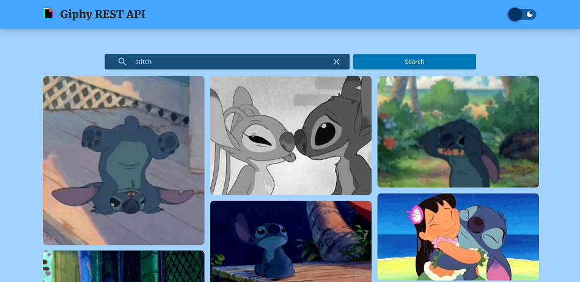

# Giphy Rest API Search App


## Table of contents

- [Overview](#overview)
  - [The challenge](#the-challenge)
  - [Screenshot](#screenshot)
  - [Links](#links)
- [Instructions](#instructions)
  - [Setup Development](#setup-development)
  - [Run Project](#run-project)
    - [Static Server](#static-server)
  - [Deploy Project](#deploy-project)
- [Useful resources](#useful-resources)
- [Author](#author)

## Overview

### The challenge

- [x] Build an Angular / React, or Vue web app
- [x] Consume Giphy REST Api for search
- [ ] The app should deal with data using Redux design pattern on Angular/React
- [x] User should be able to search gifs by names
- [x] Gifs should be presented in a grid
- [x] Data pagination needs to be on. the app should fetch 10 results per call. Once the user
      scrolls to the end of a page, another batch of data gets loaded and presented to the user
- [x] The app should be deployed to AWS, GCP, Azure, or Heroku
- [x] Whatever framework is used, the app should be built on Typescript (not Javascript)

### Screenshot





### Links

- Solution URL: [Solution](https://github.com/fidellim/Giphy-Rest-API-Search-App)
- Live Site URL: [Live Site](https://giphy-rest-api-fidellim.herokuapp.com/)

## Instructions

### Setup Development

To setup the project for development, please follow these steps:

1. Download my project as a [zip](https://github.com/fidellim/Giphy-Rest-API-Search-App) or clone my repository using this command

```
git clone https://github.com/fidellim/Giphy-Rest-API-Search-App.git
```

2. Once you are on the directory of the project using terminal, install all dependencies:
   1. npm: `npm install`
   2. yarn: `yarn install`
3. After that you can start running the project in development server using this command:
   1. npm: `npm start`
   2. yarn: `yarn start`

### Run Project

#### `Static Server`

To run the project in a production build, please follow these steps:

1. Make sure you have a build folder for the project.
   1. npm: `npm build`
   2. yarn: `yarn build`
2. Add serve dependency
   1. npm: `npm install -g serve`
   2. yarn: `yarn global add serve`
3. Finally, you can run with this command:
   1. npm/yarn: `npx serve -s build`

### Deploy Project

If you would like to deploy the project in `Heroku`, please follow these steps:

1. Create an account. If you already have, just login.
2. Create a new app using the “New” button in the top right corner of home page.
3. Then, you can enter the name for your app. Choose the region along with it.
4. To deploy your app in Heroku, there are three ways: `Heroku Git`, `GitHub`, `Container Registry`. For this project, I opted for `Connect to GitHub`.
5. A buildpack is also needed in deploying the react app. By default, Heroku uses their own but this will cause an error if not replaced. In order to do that, go to the Settings tab. Scroll down to the Buildpack section (see screenshot below) and click on the Add Buildpack button. Copy and paste the link send below:

```
https://github.com/mars/create-react-app-buildpack.git
```

6. Now, you can go back to deploy tab and connect with your GitHub account.
7. Search for the repository you would like to deploy (make sure to choose the right branch). You could also enable `Automatic Deploys`. So that every time you push your changes to GitHub, Heroku will automatically redeploy your app.
8. Finally, click the `Deploy Branch` button. After a few minutes, you will be able to view your app!

## Useful resources

- [React Switch](https://www.npmjs.com/package/react-switch) - package used for creating toggle switch.
- [Dark Mode Switcher](https://medium.com/swlh/dark-mode-using-css-variables-cf065a7fa133) - implement dark and light theme to app using SCSS.
- [Env variables w/o using dotenv - I](https://stackoverflow.com/questions/49579028/adding-an-env-file-to-react-project) - hide confidential variable values in React.
- [Env variables w/o using dotenv - II](https://create-react-app.dev/docs/adding-custom-environment-variables/) - hide confidential variable values in React.
- [Search bar inspiration](https://dribbble.com/shots/10874936-Search-Component-with-Autocomplete) - search bar design in Dribbble.
- [ReactDOM.render not supported in React 18](https://dev.to/osmanforhad/react-js-warning-reactdomrender-is-no-longer-supported-in-react-18-use-createroot-instead-until-you-switch-to-the-new-api-1jhh) - ReactDOM.render is no longer supported in React 18.
- [GIPHY-JS Documentation](https://github.com/Giphy/giphy-js) - documentation of components related to GIPHY API.
- [GIPHY Developers - I](https://developers.giphy.com/docs/api) - documentation of GIPHY API.
- [GIPHY Developers - II](https://developers.giphy.com/docs/sdk/#web) - documentation of GIPHY API.
- [Heroku Deployment](https://medium.com/make-it-heady/deploying-create-react-app-on-heroku-from-github-49447561f670) - guide on deploying React app using Heroku.

## Author

- Website - [Fidel Lim](https://fidellim-portfolio.netlify.app/)
- Frontend Mentor - [@fidellim](https://www.frontendmentor.io/profile/fidellim)
- Github - [@fidellim](https://github.com/fidellim)
